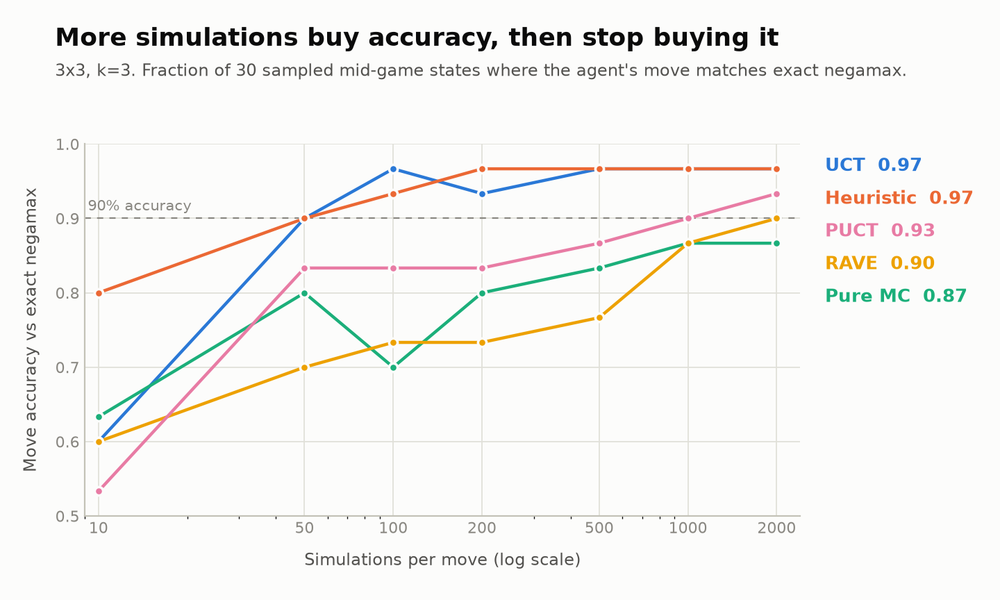
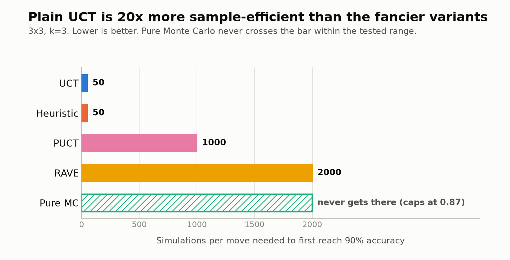
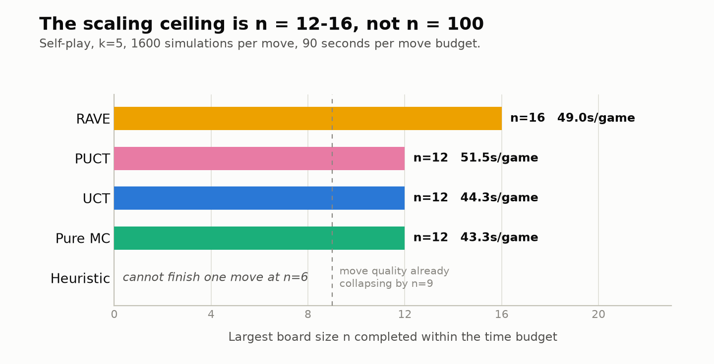

*This post was proofread with the assistance of AI.*

---

MTD(f) was the sharpest algorithm in the last post. On a 4x4 board where you need 4 in a row to win, it spends about 13 seconds choosing a single move.

Thirteen seconds. On sixteen squares. A 6x6 board has thirty-six squares, a 10x10 board has a hundred, and the search tree grows roughly like $b^d$ in all of them. Every algorithm after MiniMax in that post, Alpha-Beta through Best Node Search, searched less of the tree while returning the same answer. They all worked and they all lost anyway, because the tree grows faster than the pruning saves.

So this post gives up on the guarantee, though not on playing well. The algorithm here will sometimes play a move that is not optimal, and in exchange it keeps working on boards where exact search cannot finish a single turn.

## The Case for Being Wrong on Purpose

Exact search considers 100% of the relevant tree, whether through expansion (MiniMax), pruning (Alpha-Beta), or bounding (MTD(f)). Sitting with that, a natural line of questions appears:

> Would my algorithm really perform worse on 99% of the search tree? Likely not.

> What about 75%? Maybe.

> 50%? Hmm, but it sure is faster.

> Well, I will never have all the time in the world. If I can only afford x% of the tree, I want the best result that this x% can buy.

### Would you "settle" in life?

To *satisfice* is to choose an option that is good enough rather than hunting for the absolute best one. Herbert A. Simon coined it in 1956 by fusing *satisfy* and *suffice*, describing how people actually decide when time, energy, or information run short. It won him a Nobel Prize in Economics twenty years later.

We satisfice constantly:

> Would you rather take the second-fastest route to school, or spend an hour researching the fastest one?

> Would you rather cherish the person you have, or spend years looking for someone marginally more compatible? (I digress.)

Given a fixed budget, how do you strategically search a tree you have not explored yet? Stop being systematic and start embracing stochasticity (simply, randomness).

## What Monte Carlo Actually Means


*The Monte Carlo Casino in Monaco, which lent its name to the method.*

A Monte Carlo method estimates a quantity you cannot compute directly, by sampling it at random, many times, and averaging. Stanislaw Ulam and Nicholas Metropolis, working on neutron diffusion at Los Alamos in the 1940s, named it after the casino.

The classic toy example: to estimate $\pi$, throw darts uniformly at a square with a circle inscribed in it. The fraction landing inside approaches $\pi/4$. Nobody computed an integral. They threw darts and counted.

Now apply that to a game. Instead of computing a position's true value by searching every continuation beneath it, play the position out to the end with random moves, note who won, and repeat. A position that wins 800 of 1000 random playouts is probably a good position. An exhaustive calculation has become a statistic, and the statistic improves the more darts you throw.

Monte Carlo Tree Search (MCTS) is what happens when you wrap that statistic in a tree that remembers.

## The Four Phases


*One iteration of MCTS.*

Every MCTS iteration runs the same four phases. Each node in the tree stores two numbers: $n$, how many times it has been visited, and $w$, how many of those visits ended in a win.

**Selection.** Walk down the existing tree from the root, choosing a child at each step by some selection rule, until you reach a node with unexpanded children. Pure MCTS picks uniformly at random. Everything interesting in this post is a better selection rule.

**Expansion.** At that node, add one child representing a legal move not yet in the tree.

**Simulation.** From the new child, play to a terminal state choosing moves at random. This is the *rollout*, and it costs almost nothing, because picking a random move is a single array index.

**Backpropagation.** Walk back up the path, incrementing $n$ on every node and $w$ on the nodes belonging to the player who won.

One iteration, drawn as counters:

```text
Before                              After one iteration
   root  12/20                         root  12/21
   /          \                        /          \
A 7/12      B 5/8                   A 7/12      B 5/9
                                                   \
                                                 C 0/1   <- new node; its
                                                            rollout was a loss
```

Run that loop a few thousand times and the visit counts concentrate on branches that keep winning. When the budget runs out, play the root child with the most visits. Note what never happened: nobody wrote a function that scores a half-finished board. MCTS needs no intermediate reward heuristic, only the ability to detect a terminal state and say who won. That is why it transferred to Go, where nobody knew how to write a good intermediate evaluation function in the first place.

## Pure MCTS, and Why It Is Not MiniMax

Pure MCTS selects uniformly. Given $m$ children, each is chosen with probability $1/m$, so after $K$ iterations each child has been visited about $K/m$ times.

The obvious question is whether enough iterations turn this into MiniMax. With infinite samples, every path gets explored, so the averaged results should converge to the true value, right?

They do, slowly, with a caveat that matters. MiniMax propagates a *max* up the tree: a node's value is its best child's value, because a rational player picks that child. Pure MCTS propagates an *average* over random continuations, including every continuation where the player blunders. A position with one winning move and nine losing ones scores perfectly under MiniMax and badly under uniform rollouts. Averaging and maximising are different operators, and sampling alone never reconciles them. What does is making the sampling *non-uniform*, so good moves get sampled more and the average drifts toward the max.

A second asymmetry: exact search knows when it is done, because it ran out of tree. MCTS never knows how much tree is left, because it never enumerated it. On a small search space, prefer exact search. It is faster, predictable, and comes with a proof.

## The Dilemma Every Gambler Knows

Partway through a run, the visit counts already hint at which children are promising. Acting on that hint is dangerous, because the hint came from random samples that may have got lucky.

```text
              root  (11 simulations)
             /                     \
        node A                   node B
   8 wins / 10 visits        1 win / 1 visit
   win rate  0.80            win rate  1.00
```

Node B has a perfect record and a sample size of one. Spending the next simulation on B risks wasting it on a branch that got lucky once; spending it on A risks never discovering B was better all along.

This is the exploration-exploitation dilemma:

* **Exploitation:** take the best option according to current knowledge, which may be incomplete or misleading.
* **Exploration:** try an under-sampled option that might turn out better, giving up a known-good simulation to do it.

Clinical trials, A/B tests, ad auctions, and restaurant choice are all versions of it. The formal statement is the Multi-Armed Bandit: given several slot machines with unknown payouts and a finite number of pulls, maximise total winnings. The casino metaphor was never decorative.

## Upper Confidence Bounds for Trees

UCT is the standard answer, introduced by Levente Kocsis and Csaba Szepesvári in 2006. It replaces "pick a child at random" with "pick the child with the highest score", and builds that score from the two competing pressures directly.

Start with exploitation. For child $i$ with $w_i$ wins over $n_i$ visits, the empirical win rate is

$$\frac{w_i}{n_i}$$

A high win rate says this child looks good, so exploit it.

Now exploration. Let $N$ be the visit count of the *parent* node (not the root, and not the whole tree). The ratio $N / n_i$ is large when a child has been neglected relative to its siblings. Taking $\sqrt{\ln N / n_i}$ tames it: the logarithm stops the term exploding as the parent accumulates visits, and the square root softens the decay as $n_i$ catches up. This term also goes to infinity as $n_i \to 0$, forcing every child to be tried once before any is tried twice.

Add them:

$$
\text{UCT}(i) = \underbrace{\frac{w_i}{n_i}}_{\text{exploit}} + c\,\underbrace{\sqrt{\frac{\ln N}{n_i}}}_{\text{explore}}
$$

Selection takes the $\arg\max$ of this score. It is not a probability, and reading it as one will mislead you: a child with UCT score 1.4 is not "140% likely", it is simply ranked above a child scoring 1.1.

The constant $c$ sets the trade rate. The theoretical value for rewards in $[0,1]$ is $\sqrt{2}$, and in practice it gets tuned empirically per domain.

The behaviour that falls out is what we wanted. Early on $n_i$ is small everywhere, the exploration term dominates, and UCT spreads its attention widely. As visits accumulate that term shrinks while the win rate stays put, so exploitation gradually takes over. Kocsis and Szepesvári proved the probability of selecting a suboptimal action at the root converges to zero, so UCT's evaluations converge to MiniMax's given unbounded time. The averaging operator becomes the max operator, slowly, for free.

## Heavy Playouts: Teaching the Rollout to Play

UCT is a heuristic, but a domain-agnostic one: it knows about visit counts and win rates, and nothing about TicTacToe. Using game knowledge inside the rollout instead of moving randomly gives a *heavy playout*, in contrast to the *light playout* of pure random moves.

My implementation carries five domain-aware heuristics:

* **Distance:** minimum moves still needed to complete any unblocked $k$-window.
* **Fork:** cells creating two or more simultaneous threats.
* **Taxonomy:** counts of open (both ends free) and half-open lines.
* **Threat:** counts of immediate one-move-from-win threats per player.
* **Window scorer:** scores every $k$-window, weighting near-complete ones ($k-1$ pieces, one empty) highest and the rest by open-end count and run length.

The heuristic contributes a bias term $b_i / n_i$ added to the UCT score, where $b_i$ is the heuristic's rating of move $i$. Dividing by $n_i$ decays the bias as real evidence accumulates, so the heuristic guides the early search and then gets out of the way.

Heavy playouts cost real time per simulation, and as the previous post's scaled-rewards example showed, a heuristic aimed at the wrong target makes things worse. Hold that thought; the benchmarks have something specific to say about which of these five is earning its keep.

## RAVE: Assuming Moves Are Independent


*The RAVE heuristic in MCTS*

When a rollout finishes, we update only the nodes on the path we walked, even though the rollout played many moves. If a move's value were independent of when it was played, we could credit every move in the rollout, everywhere that move appears in the tree. That assumption is called All Moves As First (AMAF), and it keeps one statistic per action, ignoring the state it was played from:

$$\text{AMAF}(a) = \frac{\text{wins in rollouts containing } a}{\text{rollouts containing } a}$$

The payoff is speed: one rollout now updates dozens of statistics instead of one, so estimates firm up far sooner. The cost is that the assumption is false. Consider the same move, the top-left corner, on two 6x6 boards with $k = 4$:

```text
Position 1                    Position 2
 !  .  .  .  .  .              !  .  .  .  .  .
 .  .  .  .  .  .              .  X  .  .  .  .
 .  .  .  X  O  .              .  .  X  .  .  .
 .  .  O  X  X  .              .  .  .  .  O  .
 .  .  .  O  .  .              .  .  .  .  O  .
 .  .  .  .  .  .              .  .  .  .  .  .
```

In Position 1 the fight is in the lower middle and the top-left corner is a wasted move. In Position 2 that same corner gives X three on the main diagonal with the fourth square still empty, so O must answer it immediately. AMAF pools both outcomes into one number for "play the top-left corner", and that number describes neither position.

What we did there was *loosen the constraints* of the problem: drop the dependence on state, accept a worse estimate, gain a much cheaper one. That is the standard move in heuristic design and it recurs throughout informed search, so it is worth naming. (Berkeley's CS188 textbook has a [good treatment of relaxation-based heuristics](https://inst.eecs.berkeley.edu/~cs188/textbook/search/informed.html#141-heuristics).)

Rapid Action Value Estimation (RAVE), from Sylvain Gelly and David Silver in 2007, blends the two. When a node has few visits, trust AMAF, because a rough number beats no number; once UCT statistics accumulate, trust those instead. A weighted average does the work:

$$V = \alpha A + (1 - \alpha) U$$

where $A$ is the AMAF score and $U$ is the UCT score. The simplest schedule for $\alpha$ is linear in the node's real visit count $n$:

$$\alpha = \max\left(0,\ \frac{C_{\text{rave}} - n}{C_{\text{rave}}}\right)$$

Past $C_{\text{rave}}$ visits, AMAF is ignored entirely. (Better weightings exist in Tristan Cazenave's [Generalized RAVE literature](https://www.researchgate.net/publication/316147806_Generalized_Rapid_Action_Value_Estimation).)

## PUCT: Replacing the Heuristic With a Network


*Rosenblatt's perceptron: inputs, weights, one output.*

AMAF is, structurally, a very small learned model: action in, value out, one layer, trained by counting. Seen that way the upgrade path is obvious. Widen the input from a bare action to the whole board state, stack layers between input and output, and train the weights by gradient descent instead of counting. The network now answers a richer question: given this position and this candidate move, how good is it?

That is the Predictor + UCT algorithm, PUCT, introduced by Christopher Rosin in 2011. It replaces the hand-written bias term with a learned prior $P(i)$ and shapes the exploration term around it:

$$\text{PUCT}(i) = \frac{w_i}{n_i} + c\, P(i)\, \frac{\sqrt{N}}{1 + n_i}$$

Moves the network likes get explored first; moves it dislikes get explored later. The search corrects the network's mistakes, and the network stops the search wasting time in obviously bad regions.

This is the architecture DeepMind adapted for AlphaGo, which beat Lee Sedol, a 9-dan professional, 4 games to 1 in March 2016.


*Game 4, the one AlphaGo lost. Lee Sedol's move 78, the "wedge", was one AlphaGo's policy network rated at roughly 1 in 10,000, so the search barely looked at it and played poorly for the rest of the game. Diagram [CC BY-SA 4.0](https://creativecommons.org/licenses/by-sa/4.0), via Wikimedia Commons.*

The game AlphaGo lost is the more instructive one. A learned prior is a very good guess about where to look, and a very good guess is still a guess. How that prior gets trained, and what AlphaZero changed by discarding human games entirely, is the next post.

## What the Benchmarks Say

I implemented five agents against an $n \times n$, $k$-in-a-row engine: pure MCTS, UCT, heuristic-guided UCT, RAVE, and PUCT. The baseline is MTD(f) from the previous post with no depth cutoff, so it is genuinely exact. Accuracy is the fraction of 30 sampled mid-game positions where the agent's move matches full-depth negamax.

### Simulations buy accuracy, and then stop



Every agent improves with more simulations, which is expected. The interesting part is where each stops improving. UCT and the heuristic variant reach 0.97 accuracy by 100 to 200 simulations and then flatten. PUCT crawls to 0.93 by 2000. RAVE and pure MCTS are still climbing at 2000 without plateauing.

Nobody reaches 1.0. On a 3x3 board that exact search solves in milliseconds, the best MCTS variant is still wrong about one position in thirty after two thousand simulations. That is the price of the guarantee we gave up, stated plainly.

RAVE underperforming here is its own assumption failing. A 3x3 game lasts at most nine moves, every one tightly coupled to the others, so the AMAF premise that a move's value ignores its context is close to maximally wrong on the smallest possible board.



Ranked by sample efficiency, plain UCT and the heuristic variant need 50 simulations to cross 90%. PUCT needs 1000, RAVE needs 2000, and pure MCTS never gets there.

Charging each agent for wall-clock time widens the gap rather than closing it. UCT reaches 90% accuracy in 0.033 seconds; PUCT needs 0.928 seconds for the same accuracy, 28 times longer, because every simulation pays for a network forward pass.

The PUCT result carries a caveat, because it is a fair test of the wrong thing. My PUCT agent runs a randomly initialised policy network with no training at all, included as a baseline ahead of the AlphaZero post. An untrained prior is noise, and UCT beat it at all seven simulation levels. Read it as confirmation that PUCT without training is UCT plus a distraction, not as a verdict on PUCT.

### The heuristic ensemble does almost nothing

The heuristic agent beats plain UCT at low simulation counts. I assumed the five-heuristic ensemble was responsible, so I tested which heuristic drove the gain by running each one alone.

| Heuristic | Accuracy at 200 sims |
|---|---|
| distance | 0.97 |
| fork | 0.97 |
| taxonomy | 0.97 |
| threat | 0.97 |
| window scorer | 0.97 |
| all five | 0.97 |

Every configuration ties, which pointed at something else in the code path. Before any heuristic runs, the agent checks for a *forced move*, an immediate win to take or an immediate loss to block, and plays it outright.

So I built an agent that is plain UCT with forced-move detection bolted on and no heuristic at all. It matches the full heuristic agent exactly at five of the seven simulation levels, and sits within one sampled position (3.3%) at the other two.

#### Parsimonious Models

The entire measured advantage of five hand-designed heuristics comes from a check any beginner writes on their first afternoon: if you can win, win; if they can win, block. Everything I layered on top contributes nothing detectable, while costing enough per simulation to drop the heuristic agent from competitive to unusable once wall-clock time is the currency.

Statisticians have a name for the trap I fell into. Add another explanatory variable to a model and the fit almost never gets worse, so accuracy on its own will always vote for more. Occam's razor is the counterweight: prefer the simplest explanation that accounts for the data. Under a fixed budget of compute and time, the leanest model that performs as well as the elaborate one wins outright, because everything it does not spend on features it can spend on simulations.

### The ceiling arrives sooner than hoped

Since MTD(f) is infeasible past $n \approx 5$, measuring scale needs two other references: self-play under a 90-second-per-move budget, to find where MCTS stops running at all, and a fixed-budget agent against a 10x-budget copy of itself, to find where its move quality stops holding up.



At 1600 simulations per move the honest ceiling is $n \approx 12$ to $16$. RAVE stretches furthest, to 16x16. The heuristic agent cannot complete a single move on a 6x6 board. A 100x100 board is unreachable for every variant.

The quality measurement lands almost on top of that. At $n = 6$, the fixed-budget agent mostly holds its own against its 10x-stronger self, drawing 5 of 5 as RAVE and as PUCT. At $n = 9$ it collapses: UCT and PUCT lose all five, RAVE wins one and loses four.

Those two walls arriving at nearly the same board size is the finding that matters. There is no comfortable middle band where MCTS is accurate but slow, waiting to be rescued by faster hardware. Quality degrades at $n = 9$ and tractability ends around $n = 12$, so buying compute moves both limits together, and neither very far.

### So is MCTS better than MTD(f)?

On 3x3, a solved draw, MCTS never beats MTD(f). At 1600 simulations UCT and the heuristic agent hold all 20 games to draws, the best result available; pure MCTS leaks 2 losses, RAVE 5, PUCT 6.

I originally read the 4x4 results as parity, because across 20 side-swapped games every variant scored roughly 50/50 against MTD(f). Splitting those results by starting side killed that reading. Every win came from playing X, and every variant scored zero wins as O. The board was a forced first-player win, so both algorithms won whenever they moved first. The board decided those games, not the search.

The honest comparison needed a board where the draw has to be earned. Deterministic MTD(f) self-play found one: 4x4 with $k = 4$ is a genuine draw. Rerun there:

| Simulations | Agent | W / L / D of 20 |
|---|---|---|
| 200 | pure MCTS | 0 / 2 / 18 |
| 200 | UCT | 0 / 0 / 20 |
| 200 | heuristic | 0 / 0 / 20 |
| 200 | RAVE | 0 / 10 / 10 |
| 200 | PUCT | 0 / 0 / 20 |
| 1600 | all five | 0 / 0 / 20 |

At 200 simulations, RAVE loses half its games and pure MCTS leaks two. At 1600, all five hold the draw perfectly. Every row shows zero wins from either starting position, so those losses are genuine search-quality shortfalls rather than board structure.

That is the real answer. MCTS does not beat exact search and never will, because MTD(f) returns the provably optimal move while MCTS returns an empirical win rate. What MCTS offers is a dial. Exact search takes the time it takes; MCTS takes the time you give it and returns the best answer that budget buys. On small boards, use exact search and take the proof. Where exact search cannot finish, a satisficing answer is the only kind on offer.

## What I Took Away

**Optimising and satisficing are different jobs.** Economics starts from limited resources and unlimited wants, and most real decisions inherit that shape. We often know the best approach and cannot afford it, so the question becomes "what is the best answer this budget buys". The exploration-exploitation framing gives that structure: spend early effort broadly, narrow as evidence accumulates, and make the narrowing gradual rather than a switch. Plan, but do not plan to completion, because the plan improves fastest once you are executing it and generating real data.

**Heuristics help, and they are not authoritative.** Five carefully designed heuristics contributed nothing measurable over a two-line forced-move check, and I would not have believed it without measuring. Heuristics run our daily lives too: a busy restaurant is probably good, what feels right probably is right, a run of red probably means black is due. That last one is the Gambler's Fallacy, a useful reminder that a heuristic's confidence and its accuracy are loosely-related quantities. Growing in knowledge is noticing which heuristics you are running. Growing in wisdom is knowing which situations they survive.

**The small steps matter.** MCTS is a modest extension of MiniMax: keep the tree, replace exhaustive expansion with sampling, replace the max with an average that slowly becomes a max again. That one trade, paid for with the correctness guarantee, opened problems exact search could not touch, and ten years after Kocsis and Szepesvári's paper it beat the best Go player alive. Nielsen and Chuang make the same argument in *Quantum Computation and Quantum Information*, and I keep returning to it while reading that book: the frontier looks insurmountable from outside, and it was built one small correct step at a time.

## Food for Thought

1. Suppose the goal changes from winning to not losing, so a draw counts as success. Is there an agent that scales to a 100x100 board and reliably achieves it? (There is, and it is embarrassingly simple. When $k = n$, a random agent suffices, because completing a full-length line before your opponent occupies any one of its $n$ cells becomes vanishingly unlikely.)

2. MCTS interpolates between a random agent (one simulation per move) and exact search (infinite simulations). Where is the sweet spot? AlphaGo fixed it at 1600 simulations on a 19x19 board, roughly four per legal opening move, which works only because the network prior is strong. My implementation scales simulations as $200n^2$ so that every root child gets sampled, since a budget below the action space degenerates into random play. Both are defensible. Neither is derived.

3. Is MCTS parallelisable? Four workers on independent trees waste three-quarters of their statistics; four workers sharing one tree contend on every backpropagation. Is there a batched formulation, closer to $k$-beam search, that shares the statistics without the contention?

---

*Next: how AlphaZero trains the network that PUCT depends on, using no human games at all, and what that costs.*

---

# Appendix

Every agent discussed here lives in one repository: [github.com/choonyongchan/TicTacToe](https://github.com/choonyongchan/TicTacToe). Clone it and you can play any of them against each other on a board of your choosing.

## A1. Why the First Player Wins $n \times n$ TicTacToe with $k = 3$, for $n \geq 4$

Two arguments, neither a formal proof, both worth having as intuition.

**The first player cannot lose.** Suppose the second player had a winning strategy. The first player could then make an arbitrary opening move, mentally discard it, and follow the second player's strategy as if they had moved second. Whenever the strategy calls for a square already holding their discarded mark, they make another arbitrary move. An extra mark on the board never hurts you in a game where the goal is to build a line, so this "stolen" strategy wins for the first player too. Both players cannot have a winning strategy, so the second player has none. The game is a first-player win or a draw. (This is Nash's strategy-stealing argument, and note what it does not do: it proves a winning strategy exists without describing it.)

**With $k = 3$ and $n \geq 4$, the draw is unavailable.** The winning device is the *open two*: two of your marks in a line with both extension squares empty. With $k = 3$, an open two is an immediate double threat, and a single reply cannot block two squares.

X plays a central square on move 1. On a 4x4 board that mark already sits on seven distinct 3-in-a-row windows: two horizontal, two vertical, two on the main diagonal, one on the anti-diagonal. O replies with exactly one mark. On move 2, X extends into a direction whose two completion squares are both still empty. Since O has placed a single stone and X has several independent directions available, such a direction always exists. X now has two ways to make three in a row and O can block only one.

The 3x3 board is the exception that makes the general case visible. It is too cramped to host enough independent open twos, and O's reply to the centre kills enough directions at once, which is why the childhood version is a draw and every larger $k = 3$ board is not. My benchmarks show it from the other direction: on 4x4 with $k = 3$, every MCTS variant won 9 or 10 of the 10 games it started, and none of the 10 it did not.

## A2. Full Benchmark Tables

Methodology: `State.state_count` increments on every `apply()` reaching an unseen board hash, including the internal apply/undo calls agents make while searching, so a per-side delta across one turn is a directly comparable "nodes explored" metric for both MCTS and exact-search agents. All win rates come from side-swapped, per-game-seeded matches, so they reflect policy variance rather than one fixed rollout.

**Move accuracy against simulation count** (3x3, $k=3$, 30 sampled states, oracle = full-depth negamax):

| sims | pure | UCT | heuristic | RAVE | PUCT |
|---|---|---|---|---|---|
| 10 | 0.63 | 0.60 | 0.80 | 0.60 | 0.53 |
| 50 | 0.80 | 0.90 | 0.90 | 0.70 | 0.83 |
| 100 | 0.70 | 0.97 | 0.93 | 0.73 | 0.83 |
| 200 | 0.80 | 0.93 | 0.97 | 0.73 | 0.83 |
| 500 | 0.83 | 0.97 | 0.97 | 0.77 | 0.87 |
| 1000 | 0.87 | 0.97 | 0.97 | 0.87 | 0.90 |
| 2000 | 0.87 | 0.97 | 0.97 | 0.90 | 0.93 |

**Forced-move isolation.** `uct+forced` is plain UCT with forced-move detection and no heuristic:

| sims | UCT | uct+forced | heuristic |
|---|---|---|---|
| 10 | 0.60 | 0.77 | 0.80 |
| 50 | 0.90 | 0.90 | 0.90 |
| 100 | 0.97 | 0.93 | 0.93 |
| 200 | 0.93 | 0.97 | 0.97 |
| 500 | 0.97 | 0.97 | 0.97 |
| 1000 | 0.97 | 0.97 | 0.97 |
| 2000 | 0.97 | 0.97 | 0.97 |

**Equal wall-clock comparison** (same 3x3 runs, sorted by time):

| agent | sims | time/move (s) | accuracy |
|---|---|---|---|
| UCT | 50 | 0.033 | 0.90 |
| UCT | 100 | 0.069 | 0.97 |
| pure | 500 | 0.245 | 0.83 |
| heuristic | 100 | 0.274 | 0.93 |
| heuristic | 200 | 0.431 | 0.97 |
| PUCT | 1000 | 0.928 | 0.90 |
| UCT | 2000 | 1.483 | 0.97 |
| PUCT | 2000 | 2.391 | 0.93 |

**Against MTD(f) on 3x3** ($k=3$, 20 side-swapped games, sims = 1600). The game is a solved draw, so 20 draws is the optimum:

| agent | W / L / D |
|---|---|
| pure | 0 / 2 / 18 |
| UCT | 0 / 0 / 20 |
| heuristic | 0 / 0 / 20 |
| RAVE | 0 / 5 / 15 |
| PUCT | 0 / 6 / 14 |

**First-move advantage on 4x4, $k=3$** (20 side-swapped games vs MTD(f), sims = 1600). This is the table that killed the parity reading:

| agent | wins as X | wins as O |
|---|---|---|
| pure | 9 / 10 | 0 / 10 |
| UCT | 10 / 10 | 0 / 10 |
| heuristic | 10 / 10 | 0 / 10 |
| RAVE | 9 / 10 | 0 / 10 |
| PUCT | 9 / 10 | 0 / 10 |

**Draw-rate trend on 3x3** (out of 10 games vs MTD(f)):

| sims | pure | UCT | heuristic | RAVE | PUCT |
|---|---|---|---|---|---|
| 10 | 2 | 2 | 5 | 1 | 2 |
| 200 | 5 | 7 | 10 | 2 | 6 |
| 2000 | 10 | 10 | 10 | 7 | 7 |

**Quality against a 10x-budget copy of itself** ($k=5$, fast side at 1600 sims, strong side at 16000, 5 games side-swapped):

| n | agent | fast side W / L / D |
|---|---|---|
| 6 | pure | 0 / 4 / 1 |
| 6 | UCT | 0 / 1 / 4 |
| 6 | RAVE | 0 / 0 / 5 |
| 6 | PUCT | 0 / 0 / 5 |
| 9 | UCT | 0 / 5 / 0 |
| 9 | RAVE | 1 / 4 / 0 |
| 9 | PUCT | 0 / 5 / 0 |

## A3. Agent Map

| Name in this post | Agent id | Implementation |
|---|---|---|
| Pure MC | `mc_pure` | [`mc_pure_agent.py`](https://github.com/choonyongchan/TicTacToe/blob/main/tictactoe/agents/mc_pure_agent.py) |
| UCT | `mc_uct` | [`mc_uct_agent.py`](https://github.com/choonyongchan/TicTacToe/blob/main/tictactoe/agents/mc_uct_agent.py) |
| Heuristic | `mc_informed` | [`mc_informed_agent.py`](https://github.com/choonyongchan/TicTacToe/blob/main/tictactoe/agents/mc_informed_agent.py) |
| uct+forced | `mc_uct_forced` | [`mc_uct_forced_agent.py`](https://github.com/choonyongchan/TicTacToe/blob/main/tictactoe/agents/mc_uct_forced_agent.py) |
| RAVE | `mc_rave` | [`mc_rave_agent.py`](https://github.com/choonyongchan/TicTacToe/blob/main/tictactoe/agents/mc_rave_agent.py) |
| PUCT | `mc_puct` | [`mc_puct_agent.py`](https://github.com/choonyongchan/TicTacToe/blob/main/tictactoe/agents/mc_puct_agent.py) |
| MTD(f) baseline | `mtdf` | [`mtdf_agent.py`](https://github.com/choonyongchan/TicTacToe/blob/main/tictactoe/agents/mtdf_agent.py) |

## A4. References

* Kocsis, L. and Szepesvári, C. (2006). *Bandit based Monte-Carlo Planning.* ECML. The UCT paper.
* Gelly, S. and Silver, D. (2007). *Combining Online and Offline Knowledge in UCT.* ICML. RAVE.
* Rosin, C. (2011). *Multi-armed bandits with episode context.* Annals of Mathematics and AI. PUCT.
* Simon, H. A. (1956). *Rational choice and the structure of the environment.* Psychological Review. Satisficing.
* Silver, D. et al. (2016). *Mastering the game of Go with deep neural networks and tree search.* Nature. AlphaGo.
